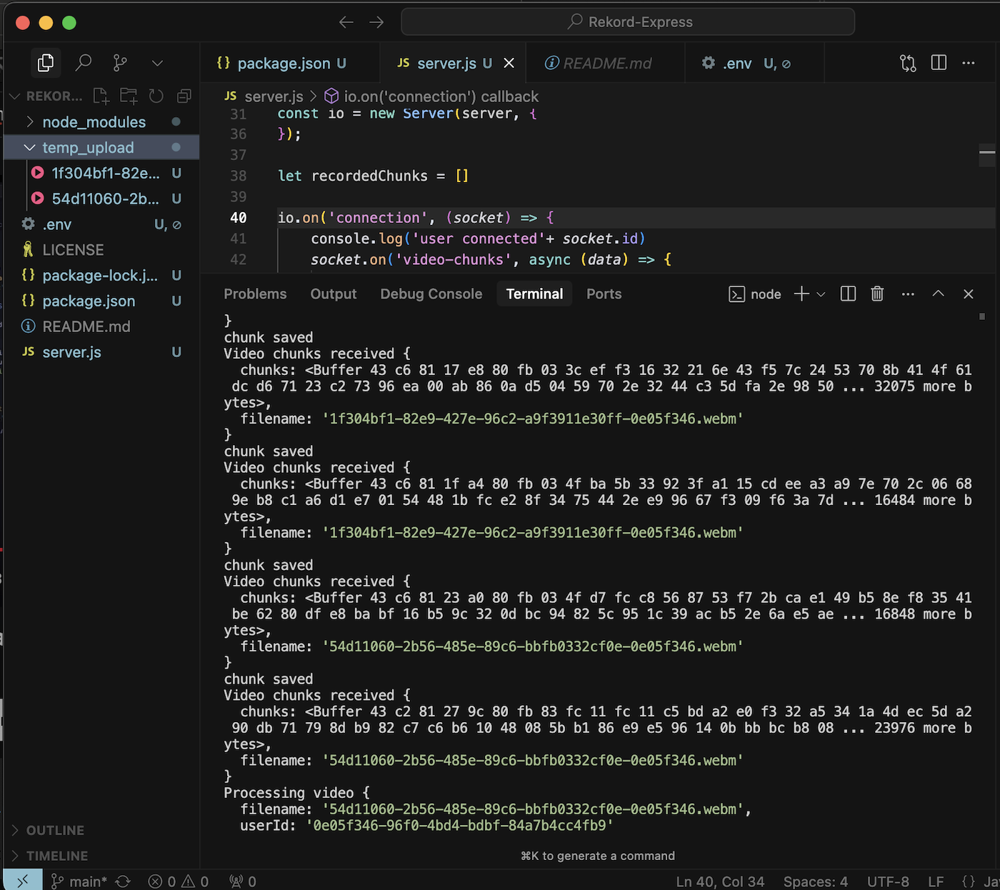

# Rekord-Express

A powerful Node.js/Express backend service for handling video recording, processing, and AI-powered analysis. This service is designed to work seamlessly with AWS S3 for storage, CloudFront for content delivery, and OpenAI for advanced video content analysis. This is the backend service that powers the Rekord ecosystem, working in conjunction with the [Rekord Desktop App](https://github.com/AnirbanDey-9497/Rekord-Desktop) and [Rekord Frontend](https://github.com/AnirbanDey-9497/Rekord).

## Features

- 🎥 Real-time video recording and chunk processing
- ☁️ AWS S3 integration for video storage
- 🌐 CloudFront CDN integration for optimized video delivery
- 🤖 OpenAI integration for:
  - Video transcription (Whisper)
  - AI-powered Q&A based on video content
  - Automatic title and summary generation
- 🔒 Pro-tier features with plan-based access control
- 🔄 WebSocket support for real-time communication
- 🎯 CORS enabled for cross-origin requests

## Architecture

### Real-time Video Recording Flow
```
[Rekord Desktop App]                    [Rekord-Express]                    [Storage]
     │                                       │                                 │
     │     Start Recording                   │                                 │
     │───────────────►                      │                                 │
     │                                       │                                 │
     │     Stream Video Chunks (Real-time)   │                                 │
     │──────────────────────────────────────►│                                 │
     │                                       │                                 │
     │                                       │     Save to temp_upload/        │
     │                                       │───────────────►                 │
     │                                       │                                 │
     │     Stop Recording                    │                                 │
     │───────────────►                      │                                 │
     │                                       │                                 │
     │                                       │     Upload to AWS S3            │
     │                                       │────────────────────────────────►│
     │                                       │                                 │
     │                                       │     Serve via CloudFront        │
     │                                       │◄────────────────────────────────│
     │                                       │                                 │
     │     Receive Status                    │                                 │
     │◄───────────────                      │                                 │
```

### Data Flow
```
[Rekord Desktop] ──Real-time Video Chunks──► [Rekord-Express] ──Store──► [AWS S3]
                                                      │
                                                      │
                                                      ▼
                                              [temp_upload/]
                                                      │
                                                      │
                                                      ▼
[Rekord Frontend] ◄───Stream via CloudFront─── [CloudFront CDN]
```

### Video Chunks Processing

*Real-time video chunks being processed and saved in the console*

## Prerequisites

- Node.js (v14 or higher)
- AWS Account with:
  - S3 access
  - CloudFront distribution set up
- OpenAI API key
- Environment variables configured
- [Rekord Desktop App](https://github.com/AnirbanDey-9497/Rekord-Desktop) installed
- [Rekord Frontend](https://github.com/AnirbanDey-9497/Rekord) deployed

## Installation

1. Clone the repository:
```bash
git clone https://github.com/AnirbanDey-9497/Rekord-Express.git
cd Rekord-Express
```

2. Install dependencies:
```bash
npm install
```

3. Create a `.env` file in the root directory with the following variables:
```env
OPEN_AI_KEY=your_openai_api_key
ACCESS_KEY=your_aws_access_key
SECRET_KEY=your_aws_secret_key
BUCKET_REGION=your_aws_region
BUCKET_NAME=your_s3_bucket_name
CLOUDFRONT_DOMAIN=your_cloudfront_domain
ELECTRON_HOST=your_electron_app_host
NEXT_API_HOST=your_next_api_host
```

## Usage

### Development
```bash
npm run dev
```

### Production
```bash
npm start
```

The server will start on port 5001.

## API Endpoints

### AI Q&A Endpoint
- **POST** `/api/ai-qa`
- **Body**:
  ```json
  {
    "transcript": "video transcript text",
    "question": "user question",
    "plan": "PRO"
  }
  ```
- **Response**:
  ```json
  {
    "status": 200,
    "answer": "AI generated answer"
  }
  ```

## WebSocket Events

### Client to Server
- `video-chunks`: Send video recording chunks in real-time
- `process-video`: Trigger video processing after recording stops
- `disconnect`: Handle client disconnection

## Pro Features

The following features are only available for PRO users:
- Video transcription using OpenAI Whisper
- AI-powered Q&A based on video content
- Automatic title and summary generation

## AWS Integration

### S3 Storage
- Videos are stored in the configured S3 bucket
- Files are uploaded with proper content type and metadata
- Temporary storage in `temp_upload/` directory before S3 upload

### CloudFront CDN
- Videos are served through CloudFront for optimized delivery
- Reduced latency and improved playback performance
- Global content distribution
- HTTPS support for secure video delivery

## Project Structure

```
Rekord-Express/
├── server.js          # Main application file
├── temp_upload/       # Temporary storage for video chunks
├── package.json       # Project dependencies
└── .env              # Environment variables (create this)
```

## Contributing

1. Fork the repository
2. Create your feature branch (`git checkout -b feature/AmazingFeature`)
3. Commit your changes (`git commit -m 'Add some AmazingFeature'`)
4. Push to the branch (`git push origin feature/AmazingFeature`)
5. Open a Pull Request

## License

This project is licensed under the ISC License - see the [LICENSE](LICENSE) file for details.

## Author

Anirban Dey

## Project Identifier

`REKORD-EXPRESS-2024-AD`
